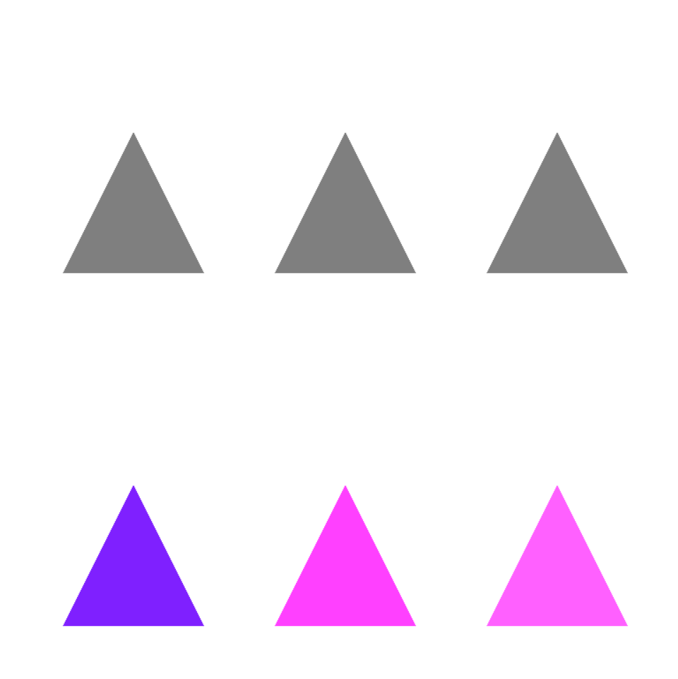
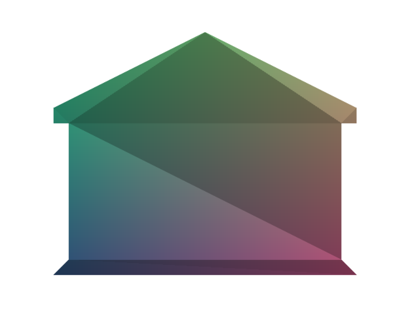
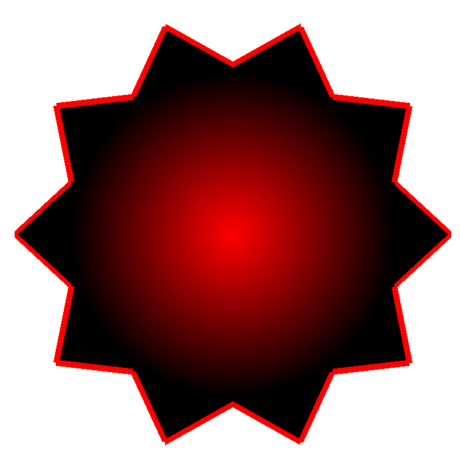

# ZADANIE 01

### kolorowe punkty N=100

# ZADANIE 02

### 2 potoki: jeden tworzy szare trójkąty, drugi kolorowe

# ZADANIE 03

### domek z wierzchołków z Blendera z kolorem wg pozycji + obracanie na WSADzie

# ZADANIE 04

### gwiazda N-ramienna z czerwonym środkiem przechodzącym w gradient czarnego + czerwone obramowanie

